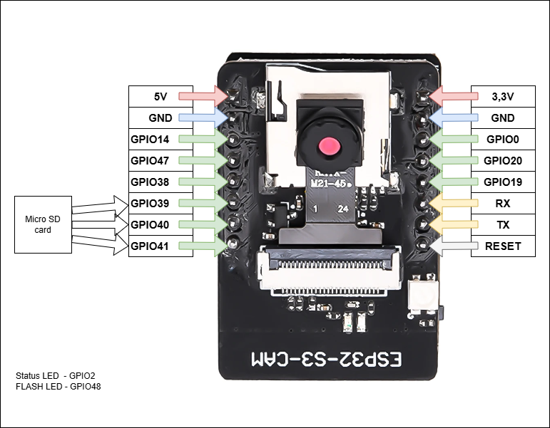
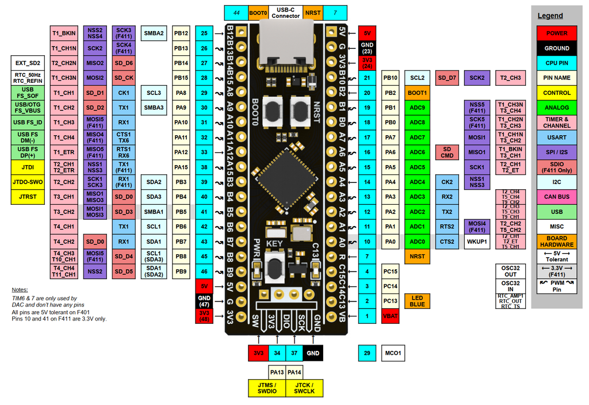

# STM-FaceGuard

**Hệ thống Khóa thông minh nhận diện khuôn mặt — Dual-MCU**

Dự án đồ án môn học xây dựng hệ thống khóa thông minh sử dụng kiến trúc Dual-MCU: **STM32F411CEU6** đảm nhận vai trò điều khiển trung tâm, **ESP32-S3 N16R8 CAM** (tích hợp camera OV3660 3MP) chạy thuật toán AI nhận diện khuôn mặt thời gian thực. Hệ thống hỗ trợ phản hồi âm thanh tiếng Việt qua DFPlayer Mini và hiển thị trạng thái trên màn hình OLED SSD1306.

> **Lưu ý nhận dạng board:** module dùng trong project là loại **ESP32-S3-CAM / ESP32-S3 N16R8 CAM** với camera **OV3660**. Ở biến thể board đang dùng, cặp chân `TX/RX` trên header được giữ lại cho nạp code và Serial Monitor; UART sang STM32 dùng **GPIO19 (TX)** và **GPIO20 (RX)** theo firmware hiện tại.

---

## Mục lục

- [Tính năng](#tính-năng)
- [Kiến trúc hệ thống](#kiến-trúc-hệ-thống)
- [Danh sách linh kiện](#danh-sách-linh-kiện)
- [Hướng dẫn kết nối chi tiết](#hướng-dẫn-kết-nối-chi-tiết)
- [Cấu hình giao tiếp](#cấu-hình-giao-tiếp)
- [Hướng dẫn sử dụng](#hướng-dẫn-sử-dụng)
- [Màn hình OLED](#màn-hình-oled)
- [Cơ chế bảo mật](#cơ-chế-bảo-mật)
- [Giao thức UART](#giao-thức-uart)
- [Chuẩn bị file âm thanh](#chuẩn-bị-file-âm-thanh-dfplayer)
- [Công cụ phát triển](#công-cụ-phát-triển)
- [Cấu trúc dự án](#cấu-trúc-dự-án)
- [Thông số hệ thống](#thông-số-hệ-thống)

---

## Tính năng

- **Nhận diện khuôn mặt thời gian thực** — ESP32-S3 xử lý AI với camera OV3660 3MP, cosine similarity ≥ 0.45
- **Voting 1 frame ngay lập tức** — phản hồi instant (1 khung hình), có thể nâng lên 2-3 frames để giảm false positive
- **Bảo vệ brute-force (Lockout)** — khóa 5 phút sau 5 lần nhận diện thất bại liên tiếp
- **Quản lý người dùng bằng nút nhấn** — Thêm và xóa khuôn mặt offline, không cần máy tính
- **Đăng ký đơn giản (1 tư thế)** — Chỉ cần nhìn thẳng (FRONT), có thể nâng lên 5 tư thế (FRONT/LEFT/RIGHT/UP/DOWN) để tăng độ chính xác
- **Phản hồi âm thanh tiếng Việt** — DFPlayer Mini phát 10 file MP3 hướng dẫn
- **Hiển thị trạng thái OLED** — Màn hình 128×64 px hiển thị thông tin và hướng dẫn từng bước
- **Hiển thị số khuôn mặt** — Màn hình READY hiện số face đã đăng ký và slot còn trống
- **Thông báo DB đầy** — Hiển thị "DB is FULL!" khi đã đủ 7 khuôn mặt
- **Mở cửa từ bên trong** — Nút EXIT (PC13) ưu tiên cao nhất, hoạt động ngay lập tức
- **Lưu khuôn mặt vào Flash** — Tối đa 7 khuôn mặt lưu trong NVS Flash của ESP32-S3
- **Đèn trợ sáng khuôn mặt** — ESP32-S3 bật đèn trắng ngắn khi thấy mặt trong khung hình để tăng sáng lúc nhận diện/enroll
- **Kết nối tự động** — Màn hình "Connecting..." khi boot; tự chuyển "OFFLINE" nếu ESP32 không phản hồi sau 30 giây
- **UART DMA hiệu năng cao** — Sử dụng **DMA kết hợp Idle Line Detection** giúp nhận dữ liệu gói lớn không tốn CPU và không mất ký tự khi xử lý OLED.
- **UART có xác thực gói** — Khi cả STM32 và ESP32 đều dùng firmware mới, các bản tin UART được bọc `sequence + ciphertext + tag` để tránh tiêm lệnh/replay kiểu văn bản thuần.
- **Tự phục hồi ESP32 nhiều tầng** — STM32 tự thử `STATUS` → `REBOOT` mềm → reset cứng qua `PB1 -> EN/RESET` khi mất kết nối quá lâu
- **Watchdog kép** — IWDG (STM32, ~5.0s) + Task WDT (ESP32, 30s) reset tự động nếu firmware bị treo

---

## Kiến trúc hệ thống

```
┌─────────────────────────────────────────────────────────────────┐
│                        TẦNG ĐẦU VÀO                             │
│  [Camera OV3660 3MP]                 [BTN_EXIT   PC13         ] │
│       tích hợp trong                [BTN_ENROLL  PA0          ] │
│  [ESP32-S3 N16R8 CAM]               [BTN_DELETE  PA1          ] │
│         │                                                        │
└─────────┼────────────────────────────────────────────────────────┘
          │ UART1 115200 baud (DMA + IDLE Line)
         │ PA9 (TX) ←→ GPIO20 (RX)
          │ PA10(RX) ←→ GPIO19 (TX)
          │ PB1 (RST) → ESP32 EN/RESET
          ▼
┌─────────────────────────────────────────────────────────────────┐
│                   TẦNG ĐIỀU KHIỂN TRUNG TÂM                     │
│                   STM32F411CEU6 (100 MHz)                       │
│                   Black Pill Board                              │
└────────┬─────────────────────┬──────────────────────┬───────────┘
         │ GPIO PB0            │ USART6 9600 baud      │ I2C1 100kHz
         ▼                     ▼                       ▼
┌──────────────────┐  ┌─────────────────────┐  ┌────────────────┐
│ PB0 → Relay      │  │   DFPlayer Mini     │  │  OLED SSD1306  │
│ Module 1ch 5V    │  │   + Loa 3070 3W     │  │  128×64 px     │
│      │           │  └─────────────────────┘  └────────────────┘
│ SM1373 12V Lock  │
└──────────────────┘
```

**Nguyên lý hoạt động:**
1. ESP32-S3 liên tục thu ảnh từ camera OV3660 tích hợp và chạy thuật toán Face Recognition
2. Nhận diện khớp **1 frame hợp lệ** (voting hiện tại) → gửi `OPEN:<ID>` qua UART → STM32 kích relay mở khóa 3 giây
3. Nhận diện thất bại → gửi `DENIED` → STM32 phát cảnh báo; sau 5 lần thất bại → `LOCKOUT` → khoá 5 phút

**Luồng khởi động:**
```
[Boot] → SYS_CONNECTING (hiện "Connecting...") → nhận READY từ ESP32 → SYS_IDLE (hiện "READY")
                                ↓ timeout 30s nếu không nhận READY
                          SYS_OFFLINE (hiện "ESP32 OFFLINE")
```

---

## Danh sách linh kiện

### I. Khối Điều khiển & AI

| STT | Tên linh kiện | Thông số | Vai trò |
|-----|--------------|----------|---------|
| 1 | **STM32F411CEU6 Black Pill** | STM32F411CEU6, Cortex-M4, 100 MHz, 512 KB Flash | Bộ não trung tâm: state machine, relay, OLED, DFPlayer |
| 2 | **ESP32-S3 N16R8 CAM** | Dual-core 240 MHz, 16 MB Flash, 8 MB PSRAM OPI | AI node: nhận diện khuôn mặt, giao tiếp UART STM32 |
| 3 | **Camera OV3660** | 3 MP, tích hợp sẵn trên board ESP32-S3 N16R8 CAM | Thu ảnh khuôn mặt chất lượng cao |

### II. Nút nhấn

| STT | Nút | Chân STM32 | Chức năng |
|-----|-----|-----------|-----------|
| 4 | **Nút EXIT** | PC13 | Mở cửa ngay từ bên trong — ưu tiên tuyệt đối |
| 5 | **Nút ENROLL** | PA0 (Input Pull-up, polling debounce) | Kích hoạt chế độ đăng ký khuôn mặt mới |
| 6 | **Nút DELETE** | PA1 (Input Pull-up, polling debounce) | Giữ 3 giây để xóa toàn bộ khuôn mặt |

> Cả 3 nút `EXIT`, `ENROLL`, `DELETE` trong cấu hình hiện tại đều là **nút rời bên ngoài**, đấu trực tiếp từ chân GPIO xuống GND và dùng pull-up nội của STM32.

### III. Phản hồi & Hiển thị

| STT | Linh kiện | Thông số | Vai trò |
|-----|----------|----------|---------|
| 7 | **OLED SSD1306** | 0.96", 128×64 px, I2C 0x3C | Hiển thị trạng thái, hướng dẫn đăng ký |
| 8 | **DFPlayer Mini** | Giải mã MP3, UART 9600 baud | Phát âm thanh tiếng Việt |
| 9 | **Loa 3070** | 8 Ω, 3 W | Phát âm thanh |
| 10 | **Thẻ MicroSD** | 1–16 GB, FAT32 | Lưu 10 file MP3 cho DFPlayer |

### IV. Chấp hành & Nguồn

| STT | Linh kiện | Thông số | Vai trò |
|-----|----------|----------|---------|
| 11 | **Khóa SM1373 V3** | 12 V DC, Fail-Secure, ~0.5 A | Cơ cấu chốt khóa, dùng nguồn 12V ngoài riêng |
| 12 | **Relay Module 1 kênh 5V** | 6 chân: `DC+`, `DC-`, `IN1` / `NO`, `COM`, `NC`, có mạch kích on-board | Nhận tín hiệu PB0 từ STM32 và đóng/ngắt đường 12V ngoài cấp cho SM1373 |
| 13 | **Nguồn 5 V** | Ổn định, ≥ 1.5 A | Cấp vào chân 5V của Black Pill; từ rail này nuôi ESP32-S3, OLED, DFPlayer Mini, thẻ MicroSD qua DFPlayer và module relay |
| 14 | **Nguồn 12 V ngoài** | Ổn định, ≥ 1 A | Chỉ cấp riêng cho khóa SM1373 qua tiếp điểm relay |

### V. Phụ kiện

| STT | Linh kiện | Vai trò |
|-----|----------|---------|
| 15 | **Điện trở 4.7 kΩ** (×2) | Pull-up cho SDA và SCL của I2C khi module OLED không có sẵn |
| 16 | **Điện trở 1 kΩ** | Bảo vệ DFPlayer RX |
| 17 | **Diode 1N4007** (×1) | Mắc song song với SM1373 để chống xung ngược khi ngắt điện |
| 18 | **Dây Jumper** | Kết nối tín hiệu giữa các module |
| 19 | **Breadboard** | Mạch thử nghiệm |

---

## Hướng dẫn kết nối chi tiết

> **Quy ước:** `→` là nguồn tín hiệu/điện, `←` là đích nhận.

---

### 1. Sơ đồ nguồn điện tổng thể

README này phản ánh đúng cách cấp nguồn thực tế đang dùng:

- **Rail 5V chung** đi vào chân `5V` của Black Pill và được chia cho toàn bộ khối điều khiển/hiển thị/âm thanh
- **Nguồn 12V ngoài riêng** chỉ dùng cho khóa SM1373 qua tiếp điểm relay
- Mức **3.3V** chỉ còn là mức logic nội bộ do Black Pill và ESP32-S3 tự tạo trên board

```
Rail 5V chung ──► Black Pill 5V pin
              ├──► ESP32-S3 5V pin
              ├──► OLED VCC
              ├──► DFPlayer Mini VCC
              └──► Relay Module DC+

GND 5V chung ──► Black Pill GND / ESP32 GND / OLED GND / DFPlayer GND / Relay Module DC-

Nguồn 12V ngoài (+) ──► Relay Module COM
Relay Module NO      ─► SM1373 dây ĐỎ (+)
Nguồn 12V ngoài (-) ─► SM1373 dây ĐEN (-)
```

> **Lưu ý quan trọng:** thẻ **MicroSD không cấp nguồn riêng bằng dây ngoài**. Thẻ chỉ cần cắm vào **DFPlayer Mini**; module DFPlayer sẽ tự cấp nguồn cho thẻ khi DFPlayer nhận `5V`.

#### Điểm nối đất (GND)

Các thiết bị ở **rail 5V chung** phải nối chung GND:

| Thiết bị | Chân GND cần nối |
|----------|-----------------|
| Nguồn 5V | GND (–) |
| STM32F411CEU6 Black Pill | GND pin |
| ESP32-S3 | GND pin |
| OLED SSD1306 | GND pin |
| DFPlayer Mini | GND pin |
| Relay Module | `DC-` |

> **Lý do:** UART giữa STM32 và ESP32-S3 cần GND chung làm điện áp tham chiếu. Nếu thiếu → tín hiệu UART nhiễu hoặc mất hoàn toàn → hệ thống không hoạt động.
>
> **Riêng phần khóa 12V ngoài:** với cách đấu qua **tiếp điểm relay cơ** như README này, nguồn `12V` cho SM1373 có thể đi **độc lập** với khối `5V`; chỉ cần đấu đúng cặp `(+/-)` của nguồn 12V vào relay và khóa.

---

### 2. ESP32-S3 N16R8 CAM ↔ STM32F411CEU6 (UART1)

Đây là kết nối quan trọng nhất — chú ý **TX nối RX, RX nối TX**.



> Theo đúng biến thể board trong ảnh này:
> - Dùng **GPIO19/GPIO20** để nối UART với STM32
> - Giữ cặp chân **`TX/RX`** trên header cho nạp code và Serial Monitor
> - Chân **`RESET`** trên header chính là đường **`EN` / `CHIP_EN`** của ESP32; hiện tại chân này đã nối với **`PB1`** của STM32 để reset cứng tự động
> - Firmware hiện bật đèn trợ sáng chính trên **GPIO47**; kênh RGB/NeoPixel **GPIO48** đang tắt mặc định để giảm tải nguồn

```
ESP32-S3          STM32F411CEU6 (Black Pill)     Nguồn
─────────         ──────────────────────────    ──────
5V            ◄──  Rail 5V chung            ◄── Chân 5V Black Pill / nguồn 5V
GND           ───  GND                       ─── GND 5V chung
GPIO19 (TX)   ──►  PA10  (USART1 RX)   [pin 31]
GPIO20 (RX)   ◄──  PA9   (USART1 TX)   [pin 30]
```

> Camera OV3660 tích hợp sẵn trên board ESP32-S3, **không cần nối thêm dây nào** cho camera.
>
> Với board đang dùng, nên **để trống header `TX/RX`** cho việc nạp code và Serial Monitor. UART sang STM32 đi qua **GPIO19/GPIO20** là ổn định hơn trong lúc phát triển.

**Lưu ý điện áp:** ESP32-S3 và STM32F411CEU6 đều giao tiếp mức 3.3V — kết nối trực tiếp tín hiệu UART, không cần level shifter.

---

### 3. OLED SSD1306 ↔ STM32F411CEU6 (I2C1)


```
OLED SSD1306      STM32F411CEU6 (Black Pill)     Nguồn 5V chung
────────────      ──────────────────────────    ────────────
VCC          ◄──────────────────────────────── Rail 5V chung
GND          ──────────────────────────────── GND 5V chung
SCL          ──►  PB6  (I2C1 SCL)
SDA          ──►  PB7  (I2C1 SDA)
```

> Địa chỉ I2C: **0x3C**. I2C chạy ở **100 kHz Standard Mode** (timing 0x10420F13) — ổn định trên breadboard, không cần Fast Mode.
>
> README này phản ánh cấu hình thực tế đang dùng: **module OLED nhận VCC 5V từ rail chung**. Tín hiệu I2C vẫn đi trực tiếp từ STM32 ở mức logic 3.3V.
>
> **Nếu OLED lúc nhận lúc không:** thêm 2 điện trở **4.7 kΩ** từ **SDA→3.3V** và **SCL→3.3V** (không kéo lên 5V). Nếu module OLED của bạn là loại chỉ hỗ trợ **3.3V VCC**, không được cấp `5V` vào chân `VCC`.

---

### 4. DFPlayer Mini ↔ STM32F411CEU6 (USART6)


```
DFPlayer Mini     STM32F411CEU6 (Black Pill)     Nguồn
─────────────     ──────────────────────────   ──────
VCC          ◄──  Rail 5V chung            ◄── Chân 5V Black Pill / nguồn 5V
GND          ───  GND                      ─── GND 5V chung
RX           ◄──  [1 kΩ] ── PA11  (USART6 TX)  ← bắt buộc có điện trở 1kΩ
TX           ──►  PA12  (USART6 RX)
SPK+         ──►  Loa 3070 chân (+)
SPK–         ──►  Loa 3070 chân (–)
```

> **Bắt buộc** đặt điện trở **1 kΩ** nối tiếp trên dây PA11 → DFPlayer RX để bảo vệ chip DFPlayer khỏi mức điện áp cao.
>
> **Thẻ MicroSD** chỉ cần cắm trực tiếp vào DFPlayer Mini; không cần kéo thêm dây nguồn riêng từ STM32 ra thẻ.

---

### 5. Module Relay 1 kênh 5V (6 chân) ↔ STM32 PB0

Relay mới đang dùng là loại **module 1 kênh 5V tích hợp sẵn mạch kích**, vì vậy:

- **Không cần** transistor **BC547** rời
- **Không cần** đế relay **PTF08A**
- Chỉ cần đấu đúng 6 chân của module: `DC+`, `DC-`, `IN1`, `NO`, `COM`, `NC`

#### Sơ đồ đấu 6 chân relay module:

```
Relay Module 1 kênh 5V        Kết nối
────────────────────────      ─────────────────────────────────────────
DC+                        ◄── Rail 5V chung
DC-                        ─── GND 5V chung
IN1                        ◄── PB0  (GPIO OUT từ STM32)

COM                        ◄── Nguồn 12V ngoài (+)
NO                         ─── SM1373 dây ĐỎ (+)
NC                         ─── Không dùng

Nguồn 12V ngoài (-)        ─── SM1373 dây ĐEN (-)
```

#### Nguyên lý:
- STM32 xuất tín hiệu điều khiển ở **PB0** → đưa vào chân **IN1** của relay module
- Khi relay **hút**, tiếp điểm **COM ↔ NO** đóng lại → cấp `12V ngoài` cho SM1373 → mở khóa
- Khi relay **nhả**, tiếp điểm **COM ↔ NO** hở → khóa không còn điện → trở về trạng thái khóa

> **Lưu ý mức kích IN1:** có module relay nhận kích ở mức **HIGH**, có module nhận kích ở mức **LOW**. Firmware hiện tại của dự án đang xuất `PB0 = HIGH` khi mở khóa. Nếu relay module của bạn hoạt động ngược ý muốn, cần đảo logic điều khiển relay trong firmware.

---

### 6. Tiếp điểm `NO / COM / NC` ↔ Nguồn 12V ngoài ↔ Khóa SM1373

| Chân relay module | Nối tới | Ghi chú |
|------------------|---------|---------|
| `DC+` | 5V | Nguồn cho module relay |
| `DC-` | GND | Mass chung của khối 5V |
| `IN1` | PB0 | Tín hiệu điều khiển từ STM32 |
| `COM` | 12V ngoài (+) | Chân chung của tiếp điểm |
| `NO` | SM1373 dây ĐỎ (+) | Dùng trong project này, chỉ có điện khi relay hút |
| `NC` | Không dùng | Bỏ trống |

```
Kết nối SM1373:
Nguồn 12V ngoài (+) ──► Relay Module COM
                        Relay Module NO ───────────► SM1373 dây ĐỎ  (+)
Nguồn 12V ngoài (–) ─────────────────────────────── SM1373 dây ĐEN (–)

1N4007 (bảo vệ SM1373): Anode → dây ĐEN, Cathode → dây ĐỎ
(mắc song song với SM1373, chống xung ngược khi ngắt điện)
```

> **SM1373 V3 — Fail-Secure:** Mất điện = khóa cứng. Có điện = mở chốt.
>
> **Quan trọng:** nguồn `12V ngoài` này chỉ phục vụ cho khóa. Không cấp `12V` vào STM32, ESP32-S3, OLED hay DFPlayer.
>
> **Vì sao không dùng `NC`:** nếu dùng `NC`, khóa sẽ có điện khi relay đang nghỉ. Với khóa fail-secure như SM1373, cách đấu đúng trong project là **COM → NO** để chỉ mở khi STM32 thật sự ra lệnh.

---

### 7. Nút nhấn ↔ STM32F411CEU6

Cả 3 nút dùng kiểu **active-LOW**: nhấn nút → chân GPIO nối GND.
Trong firmware hiện tại: `PC13` dùng EXTI, còn `PA0/PA1` đọc theo polling + debounce.

```
3.3V (pull-up nội bộ trong STM32)
  │
  ├── PA0  (BTN_ENROLL) ──[Nút ngoài]── GND
  ├── PA1  (BTN_DELETE) ──[Nút ngoài]── GND
  └── PC13 (BTN_EXIT)   ──[Nút ngoài]── GND
```

> Cách đấu chuẩn cho cả 3 nút là: một chân nút nối vào GPIO, chân còn lại nối GND. Không cần điện trở kéo ngoài nếu giữ nguyên cấu hình pull-up nội như firmware hiện tại.
>
> Firmware đã cấu hình `PC13`, `PA0`, `PA1` ở chế độ input pull-up; vì vậy có thể dùng ngay 3 nút rời mà không phải sửa code nếu vẫn giữ đúng các chân này.

---

### 8. Tổng hợp pinout STM32F411CEU6



| Chân STM32 | Số chân | Tín hiệu | Kết nối tới |
|-----------|---------|----------|-------------|
| **PA9** | 30 | USART1 TX | ESP32-S3 **GPIO20** (RX) |
| **PA10** | 31 | USART1 RX | ESP32-S3 **GPIO19** (TX) |
| **PA11** | 32 | USART6 TX | DFPlayer **RX** (qua 1kΩ) |
| **PA12** | 33 | USART6 RX | DFPlayer **TX** |
| **PA2** | 12 | USART2 TX | ST-Link Virtual COM (debug) |
| **PA3** | 13 | USART2 RX | ST-Link Virtual COM (debug) |
| **PB6** | 42 | I2C1 SCL | OLED **SCL** |
| **PB7** | 43 | I2C1 SDA | OLED **SDA** |
| **PB0** | 18 | GPIO OUT | **IN1** của relay module 1 kênh 5V |
| **PB1** | 19 | GPIO OUT | **EN/RST** của ESP32-S3 để STM32 reset cứng khi treo |
| **PA5** | 15 | GPIO OUT | LED ngoài (tùy chọn) |
| **PC13** | 2 | EXTI13 | Nút **BTN_EXIT** ngoài → GND |
| **PA0** | 10 | GPIO input | Nút **BTN_ENROLL** ngoài → GND |
| **PA1** | 11 | GPIO input | Nút **BTN_DELETE** ngoài → GND |

---

### 9. Tổng hợp pinout ESP32-S3 N16R8 CAM

**Cách nhận diện đúng board đang dùng trong project**


| Dấu hiệu | Board của project | Board dễ bị nhầm trên internet |
|---------|-------------------|---------------------------------|
| Chữ in trên mạch | `ESP32-S3-CAM` / `ESP32-S3 N16R8 CAM` | `ESP32-CAM` |
| Camera | **OV3660** | Thường là OV2640 |
| UART nối STM32 | **GPIO19 TX, GPIO20 RX** | Nhiều ảnh khác ghi GPIO1/GPIO3 hoặc chỉ `TX/RX` |
| Áp dụng README này | **Có** | **Không** |

| GPIO | Chức năng | Kết nối |
|------|----------|---------|
| **GPIO19** | UART TX sang STM32 | → STM32 PA10 (USART1 RX) |
| **GPIO20** | UART RX từ STM32 | ← STM32 PA9 (USART1 TX) |
| GPIO4 | Camera SIOD | Tích hợp sẵn trên board |
| GPIO5 | Camera SIOC | Tích hợp sẵn trên board |
| GPIO6 | Camera VSYNC | Tích hợp sẵn trên board |
| GPIO7 | Camera HREF | Tích hợp sẵn trên board |
| GPIO8–13 | Camera D2–D7 | Tích hợp sẵn trên board |
| GPIO15 | Camera XCLK | Tích hợp sẵn trên board |
| GPIO16–18 | Camera D7–D5 | Tích hợp sẵn trên board |
| GPIO47 | Đèn trợ sáng trắng chính | Tự bật ngắn khi phát hiện khuôn mặt |
| GPIO48 | RGB/NeoPixel phụ | Mặc định tắt trong firmware hiện tại |
| **5V** | Nguồn | Rail 5V chung (lấy tại chân 5V Black Pill) |
| **GND** | Đất | GND chung |

---

## Cấu hình giao tiếp

### USART1 — ESP32-S3 ↔ STM32 (115200 baud)

| Thông số | Giá trị |
|---------|--------|
| Baud rate | 115200 |
| Data / Stop / Parity | 8N1 |
| STM32 RX Method | **DMA + IDLE Line Detection** |
| STM32 TX | PA9 |
| STM32 RX | PA10 |
| ESP32-S3 TX | GPIO19 |
| ESP32-S3 RX | GPIO20 |
| Hàng đợi STM32 | 4 tin nhắn (đã tối ưu xử lý phi tập trung) |

### USART6 — DFPlayer Mini ↔ STM32 (9600 baud)

| Thông số | Giá trị |
|---------|--------|
| Baud rate | 9600 |
| Data / Stop / Parity | 8N1 |
| STM32 TX | PA11 (qua 1kΩ → DFPlayer RX) |
| STM32 RX | PA12 ← DFPlayer TX |

### I2C1 — OLED SSD1306 ↔ STM32

| Thông số | Giá trị |
|---------|--------|
| Chế độ | Standard Mode (100 kHz) — ổn định trên breadboard |
| Timing register | 0x10420F13 (ghi đè CubeMX trong USER CODE BEGIN I2C1_Init 2) |
| SCL | PB6 |
| SDA | PB7 |
| Địa chỉ OLED | 0x3C |
| Phục hồi lỗi | HAL_I2C_DeInit → HAL_I2C_Init nếu ACK không phản hồi |

---

## Hướng dẫn sử dụng

### Khởi động hệ thống

1. Cấp nguồn → STM32 khởi động, OLED hiển thị `"Booting..."` trong ~2 giây
2. OLED chuyển sang `"Connecting..."` — đang chờ ESP32-S3 boot xong
3. ESP32-S3 boot mất ~5–8 giây → STM32 tự gửi `STATUS` và nhận lại `READY/FACES` → OLED chuyển sang `"READY"`
4. Nếu sau **30 giây** vẫn không đồng bộ được với ESP32 → OLED hiện `"ESP32 OFFLINE"` — kiểm tra dây UART, nguồn và camera
5. Nếu hệ thống đang chạy mà mất link lâu bất thường, STM32 sẽ tự thử `STATUS`, sau đó `REBOOT` mềm; nếu vẫn không hồi, chân `PB1` sẽ kéo `EN/RESET` của ESP32 để reset cứng

> **Trong lúc "Connecting..."**: `ENROLL` và `DELETE` bị chặn cho tới khi ESP32 đồng bộ xong. `EXIT` vẫn mở cửa được ngay vì chạy cục bộ trên STM32.

---

### Nhận diện tự động (IDLE)

ESP32-S3 liên tục quét khuôn mặt:

| Kết quả | Hành động OLED | Âm thanh |
|---------|----------------|----------|
| Khớp voting và mở cửa | `"UNLOCKED — Face ID: X"` | Track 1: *"Xin chào, cửa đã mở"* |
| Không khớp | `"ACCESS DENIED"` | Track 2: *"Không nhận diện được, vui lòng thử lại"* |
| Không có mặt đăng ký | Giữ màn hình READY, im lặng | — |

> **Sau 5 lần DENIED liên tiếp** → kích hoạt lockout 5 phút (xem [Cơ chế bảo mật](#cơ-chế-bảo-mật))

---

### Đăng ký khuôn mặt mới (ENROLL)

1. Đứng trước camera, khoảng cách **30–60 cm**, ánh sáng đủ sáng
2. Nhấn nút **ENROLL** (PA0)
3. OLED hiện `"Enrolling..."`, loa phát *"Mời bạn nhìn vào camera"*
4. Cấu hình hiện tại chỉ dùng **1 bước FRONT**:

| Bước | OLED | Loa | Hành động |
|------|------|-----|-----------|
| 1/1 | `Step 1/1  Look STRAIGHT` | Track 6 | Nhìn thẳng vào camera; firmware chờ mặt ổn định rồi chụp và lưu ngay |

5. Hoàn tất: OLED hiện `"ENROLLED — Face #X saved! (X/7 slots)"`, loa phát *"Đã thêm khuôn mặt thành công"*
6. Màn hình tự quay về READY sau 3 giây

> **Lưu ý:**
> - Nếu không phát hiện khuôn mặt trong 10 giây, OLED nhắc lại bước hiện tại
> - Nếu 15 giây chưa nhận step enroll từ ESP32, STM32 sẽ thử gửi lại `ENROLL` tối đa 2 lần; sau đó mới hủy
> - Nếu DB đã đầy 7 slot → OLED hiện `"DB is FULL! — Delete to enroll"`, không thể đăng ký thêm

---

### Xóa toàn bộ khuôn mặt (DELETE)

1. Nhấn và **giữ** nút DELETE (PA1) trong **3 giây**
2. OLED hiển thị thanh tiến trình `"Hold 3s: Delete [====------]"`
3. Thả tay đúng 3s: OLED hiện `"Deleting..."`, ESP32-S3 xóa toàn bộ NVS flash
4. Xong: OLED hiện `"DELETED — All faces cleared"`, loa phát *"Đã xóa toàn bộ dữ liệu khuôn mặt"*
5. Màn hình tự quay về READY (hiện `"Press [ENROLL]!"`) sau 3 giây
6. Thả sớm trước 3s → hủy, không xóa; OLED về READY ngay

> **Lưu ý:** Xóa cũng đặt lại bộ đếm thất bại, hủy mọi lockout đang hoạt động.

---

### Mở cửa từ bên trong (EXIT)

1. Nhấn nút **EXIT** ngoài (PC13)
2. STM32 kích relay **ngay lập tức**, không qua ESP32
3. SM1373 mở chốt trong **3 giây**, OLED hiện `"UNLOCKED — (Exit button)"`
4. Nhấn lại EXIT trong lúc đang mở → reset đếm ngược 3 giây

---

## Màn hình OLED

Màn hình SSD1306 128×64 px được chia 8 trang (pages):

| Trang | Nội dung |
|-------|---------|
| Page 0 | Tiêu đề cố định: ` >> STM-FaceGuard` |
| Page 1 | Đường kẻ phân cách (solid) |
| Page 2–3 | Trạng thái chính (thay đổi theo state) |
| Page 4–5 | Chi tiết / hướng dẫn |
| Page 6–7 | Trống |

### Các màn hình theo trạng thái

| Trạng thái | OLED hiển thị | Khi nào |
|-----------|---------------|---------|
| `SYS_CONNECTING` | `Connecting... / Please wait` | Sau boot, chờ ESP32 |
| `SYS_OFFLINE` | `ESP32 OFFLINE / Check CAM/UART` | Timeout 30s không nhận READY |
| `SYS_IDLE` (0 face) | `** READY ** / Press [ENROLL]!` | Sẵn sàng, chưa có face nào |
| `SYS_IDLE` (có face) | `** READY ** / X face(s) stored` | Sẵn sàng, hiện số face |
| `SYS_UNLOCKING` | `** UNLOCKED ** / Face ID: X` | Đang mở cửa |
| `SYS_UNLOCKING` (exit) | `** UNLOCKED ** / (Exit button)` | Mở cửa bằng nút EXIT |
| `SYS_DENIED` | `** DENIED ** / Face not found!` | Nhận diện thất bại |
| `SYS_LOCKED` | `!! LOCKED OUT !! / Too many attempts` | Lockout bảo mật |
| `SYS_ENROLLING` | `Enrolling... / Look at camera!` | Đang đăng ký |
| `SYS_ENROLLING` (step) | `Step X/5 / Turn LEFT / <--(O)` | Hướng dẫn từng bước |
| `SYS_DELETING` | `Deleting... / Please wait` | Đang xóa |
| `SYS_RESULT` (enrolled) | `** ENROLLED ** / Face #X saved! / (X/7 slots)` | Vừa đăng ký xong |
| `SYS_RESULT` (deleted) | `** DELETED ** / All faces cleared` | Vừa xóa xong |
| `SYS_RESULT` (db full) | `DB is FULL! / Delete to enroll` | Hết slot |

---

## Cơ chế bảo mật

### 1. Voting — Chống false positive

Firmware hiện tại đang đặt `REQUIRED_MATCHES = 1`, tức chỉ cần **1 frame hợp lệ** với similarity vượt ngưỡng là ESP32 có thể gửi `OPEN`. Cấu hình này ưu tiên độ trễ thấp, nhưng nếu môi trường ánh sáng phức tạp hoặc có nguy cơ false positive thì nên tăng lên 2 hoặc 3 frame.

```
Frame 1: ID=2 sim=0.71 → vote=1/1 → CONFIRMED → gửi OPEN:2
```

### 2. Lockout — Chống brute-force

| Tham số | Giá trị |
|---------|--------|
| Ngưỡng thất bại | 5 lần liên tiếp |
| Thời gian khóa | 5 phút |
| Reset điều kiện | Nhận diện thành công **hoặc** xóa DB (DEL_ALL) |

**Luồng lockout:**
1. Thất bại lần 5 → ESP32 gửi `LOCKOUT` → STM32 vào `SYS_LOCKED`
2. OLED hiện `"!! LOCKED OUT !!"`, nút ENROLL bị chặn; nút EXIT vẫn mở cửa từ bên trong
3. Sau 5 phút → ESP32 gửi `LOCKOUT_CLEAR` → STM32 về `SYS_IDLE`

### 3. Ngưỡng nhận diện

| Tham số | Giá trị | Điều chỉnh |
|---------|--------|------------|
| `RECOGNITION_THRESHOLD` | 0.45 | Tăng → an toàn hơn nhưng có thể từ chối người hợp lệ trong điều kiện ánh sáng xấu |
| `REQUIRED_MATCHES` | 1 | Tăng → chậm hơn nhưng ít false positive hơn |

### 4. Bảo vệ UART

Khi cả hai MCU cùng chạy firmware mới, UART không còn chỉ là chuỗi văn bản trần. Link sẽ:

1. Bắt tay bằng `SECURE_HELLO / SECURE_READY` để xác nhận cả hai bên đều hỗ trợ chế độ bảo vệ.
2. Chuyển sang packet `!SEQ:CIPHERTEXT:TAG`, trong đó:
   - `SEQ` giúp phát hiện replay hoặc lặp gói.
   - `CIPHERTEXT` che payload gốc để không lộ trực tiếp `OPEN`, `DEL_ALL`, `ENROLL` trên đường UART.
   - `TAG` xác minh tính toàn vẹn của bản tin trước khi xử lý lệnh.

Nếu chỉ một bên được cập nhật, hệ thống vẫn có thể chạy ở chế độ plaintext để tương thích ngược, nhưng khi đó bảo vệ UART sẽ chưa được kích hoạt.

### 5. Tự phục hồi ESP32

STM32 hiện có cơ chế phục hồi nhiều tầng khi ESP32 không còn gửi heartbeat hợp lệ hoặc liên tục báo `CAM_FAIL`:

1. Gửi `STATUS` để thử đồng bộ lại.
2. Nếu vẫn offline quá lâu, gửi `REBOOT` để yêu cầu ESP32 tự khởi động lại bằng phần mềm.
3. Trong cấu hình phần cứng hiện tại, `PB1` đã nối sang chân `EN/RESET` của ESP32-S3, vì vậy STM32 có thể kéo reset cứng tự động khi reset mềm không đủ.

### 6. Watchdog kép

| Watchdog | Vi điều khiển | Timeout | Tác dụng |
|---------|--------------|---------|----------|
| IWDG (Independent) | STM32F411CEU6 | ~5.0 giây | Reset STM32 nếu main loop bị treo |
| Task WDT | ESP32-S3 | 30 giây | Panic + reset ESP32 nếu loop() bị treo |

> IWDG STM32F411 sử dụng LSI nội (~32 kHz), prescaler = 64, reload = 2499 → timeout ≈ 5.0 s — hoạt động ngay cả khi clock chính bị lỗi.

---

## Giao thức UART

Từ bản firmware mới, link UART hỗ trợ 2 chế độ:

- **Tương thích ngược / bootstrap**: dùng chuỗi văn bản thường cho `SECURE_HELLO`, `SECURE_READY` và khi một trong hai MCU còn đang chạy firmware cũ.
- **Chế độ bảo vệ**: khi cả hai bên đã bắt tay xong, các bản tin được đóng gói dạng `!SEQ:CIPHERTEXT:TAG` với `sequence counter`, payload đã mã hóa nhẹ và `auth tag` để giảm nguy cơ replay hoặc tiêm lệnh trực tiếp trên UART.

### ESP32-S3 → STM32

| Lệnh | Khi nào | Ý nghĩa |
|------|---------|---------|
| `READY\n` | Khởi động xong | ESP32 sẵn sàng nhận lệnh |
| `FACES:<n>\n` | Ngay sau `READY` | Số khuôn mặt đã lưu trong DB |
| `OPEN:<ID>\n` | Voting xác nhận | Mở cửa, ID = số khuôn mặt |
| `DENIED\n` | Không nhận diện được | Từ chối |
| `ENROLLED:<ID>\n` | Đăng ký xong | Khuôn mặt mới, ID mới |
| `DELETED\n` | Xóa xong | Toàn bộ DB đã xóa |
| `DB_FULL\n` | ENROLL khi đã đủ 7 face | Hết slot, từ chối đăng ký |
| `LOCKOUT\n` | 5 lần thất bại liên tiếp | Kích hoạt khóa bảo mật |
| `LOCKOUT_CLEAR\n` | Hết 5 phút khóa | Bỏ khóa, về IDLE |
| `ENROLL_FRONT\n` | Bước 1/5 | Hướng dẫn nhìn thẳng |
| `ENROLL_LEFT\n` | Bước 2/5 | Hướng dẫn quay trái |
| `ENROLL_RIGHT\n` | Bước 3/5 | Hướng dẫn quay phải |
| `ENROLL_UP\n` | Bước 4/5 | Hướng dẫn ngẩng lên |
| `ENROLL_DOWN\n` | Bước 5/5 | Hướng dẫn cúi xuống |

### STM32 → ESP32-S3

| Lệnh | Khi nào | Ý nghĩa |
|------|---------|---------|
| `ENROLL\n` | Nhấn BTN_ENROLL | Bắt đầu đăng ký khuôn mặt |
| `DEL_ALL\n` | Giữ BTN_DELETE 3s | Xóa toàn bộ database |
| `CANCEL\n` | Timeout enroll sau các lần retry | Hủy đăng ký |
| `STATUS\n` | Boot, timeout, hoặc khi cần đồng bộ lại | Yêu cầu ESP32 gửi lại `READY/FACES` và trạng thái hiện tại |
| `REBOOT\n` | STM32 phát hiện ESP32 offline quá lâu hoặc lặp `CAM_FAIL` | Yêu cầu ESP32 tự khởi động lại bằng phần mềm |

> Trong cấu hình hiện tại, `PB1` của STM32 đã nối sang chân `EN/RESET` của ESP32-S3; sau khi thử `REBOOT` mềm mà ESP32 vẫn không phục hồi thì STM32 sẽ kéo reset cứng tự động.

### STM32 → DFPlayer Mini (USART6, 9600 baud)

Giao thức binary 10 byte:

```
0x7E  0xFF  0x06  CMD  0x00  ParamH  ParamL  CkH  CkL  0xEF
```

Checksum = `-(0xFF + 0x06 + CMD + 0x00 + ParamH + ParamL)`

---

## Chuẩn bị file âm thanh (DFPlayer)

### Nội dung 10 file MP3

| Track | File | Khi nào phát | Nội dung tiếng Việt |
|-------|------|-------------|---------------------|
| 1 | `0001.mp3` | Mở cửa thành công | *"Xin chào, cửa đã mở"* |
| 2 | `0002.mp3` | Nhận diện thất bại | *"Không nhận diện được, vui lòng thử lại"* |
| 3 | `0003.mp3` | Bắt đầu đăng ký | *"Mời bạn nhìn vào camera"* |
| 4 | `0004.mp3` | Đăng ký thành công | *"Đã thêm khuôn mặt thành công"* |
| 5 | `0005.mp3` | Xóa xong | *"Đã xóa toàn bộ dữ liệu khuôn mặt"* |
| 6 | `0006.mp3` | Bước 1/5 FRONT | *"Mời nhìn thẳng vào camera"* |
| 7 | `0007.mp3` | Bước 2/5 LEFT | *"Vui lòng quay đầu sang trái"* |
| 8 | `0008.mp3` | Bước 3/5 RIGHT | *"Vui lòng quay đầu sang phải"* |
| 9 | `0009.mp3` | Bước 4/5 UP | *"Vui lòng ngước đầu lên một chút"* |
| 10 | `0010.mp3` | Bước 5/5 DOWN | *"Vui lòng cúi đầu xuống một chút"* |

### Cách tạo file MP3

**VBee Studio** (giọng Việt tự nhiên nhất): [vbee.vn](https://vbee.vn) → Studio → nhập text → chọn giọng → tải MP3

**FreeText2Speech**: [freetts.com](https://freetts.com) → chọn Vietnamese → Export MP3

### Cấu trúc thẻ MicroSD (FAT32)

```
[Thư mục gốc thẻ nhớ — không tạo thư mục con]
├── 0001.mp3
├── 0002.mp3
├── 0003.mp3
├── 0004.mp3
├── 0005.mp3
├── 0006.mp3
├── 0007.mp3
├── 0008.mp3
├── 0009.mp3
└── 0010.mp3
```

> Copy file theo **đúng thứ tự 0001 → 0010**, eject thẻ đúng cách trước khi rút.

---

## Công cụ phát triển

| Công cụ | Mục đích |
|---------|---------|
| **STM32CubeIDE** | IDE lập trình + nạp code STM32F411CEU6 |
| **STM32CubeMX 6.17** | Cấu hình Pinout, Clock, Peripheral |
| **STM32 HAL FW_F4 V1.28.x** | Thư viện HAL cho STM32F4 |
| **Arduino IDE** | Lập trình ESP32-S3 |
| **ESP32 Arduino core ≥ 2.0.6** | Board package + thư viện AI nhận diện mặt |
| **ST-Link V2 (ngoài)** | Nạp + debug STM32 (Black Pill không tích hợp ST-Link) |

### Cài đặt board ESP32-S3 trong Arduino IDE

```
Board:                 ESP32S3 Dev Module
USB CDC On Boot:       Disabled
CPU Frequency:         240MHz (WiFi/BT)
Core Debug Level:      None
USB DFU On Boot:       Disabled
Events Run On:         Core 1
Flash Mode:            DIO 80MHz
Flash Size:            16MB (128Mb)
JTAG Adapter:          Disabled
Arduino Runs On:       Core 1
USB Firmware MSC:      Disabled
Partition Scheme:      Huge APP (3MB No OTA / 1MB SPIFFS)
PSRAM:                 OPI PSRAM
Upload Mode:           UART0 / Hardware CDC
Upload Speed:          921600 (hoặc 460800 nếu nạp không ổn định)
USB Mode:              Hardware CDC and JTAG
Zigbee Mode:           Disabled
```

> Cấu hình trên được chốt theo hướng phù hợp nhất cho project này: tham khảo board profile `ESP32-S3-CAM` của Prusa nhưng **không** dùng `Minimal SPIFFS`, vì firmware `STM-FaceGuard` lớn hơn và không cần OTA riêng.

### Wi-Fi preview trên ESP32-S3

Firmware chính đã bật lại web preview nhẹ để debug trực tiếp trên máy tính:

- Board phát AP mặc định:
  - `SSID: STM-FaceGuard-Preview`
  - `Password: faceguard123`
  - `URL: http://192.168.4.1/`
- AP khởi động theo fallback: ưu tiên WPA2 (kênh 1, rồi 6). Nếu vẫn fail và `PREVIEW_AP_ALLOW_OPEN_FALLBACK = 1` thì mới hạ xuống AP mở (không mật khẩu).
- Preview dùng ảnh chụp JPEG làm mới định kỳ, **nhẹ hơn stream MJPEG**, nên ít ảnh hưởng face AI hơn.
- Nội bộ firmware dùng `JPEG capture -> fmt2rgb888 -> face AI` thay vì `RGB888 trực tiếp`, vì theo `esp32-camera` thì tổ hợp `RGB/YUV + Wi-Fi` dễ gây quá tải PSRAM và crash hơn trên ESP32-S3.
- Firmware hiện bật đèn trắng chính trên `GPIO47` trong khoảng ngắn mỗi khi thấy khuôn mặt để tăng sáng; kênh RGB `GPIO48` đang tắt mặc định để giảm rủi ro sụt áp. Nếu board thực tế khác biến thể này, sửa các hằng `FACE_LIGHT_*` trong [STM-FaceGuard.ino](/Users/phamhungtien/Documents/STM-FaceGuard/ESP32-S3/STM-FaceGuard/STM-FaceGuard.ino#L94).
- Nếu muốn cho ESP32-S3 vào cùng Wi-Fi router, sửa 2 hằng trong [STM-FaceGuard.ino](/Users/phamhungtien/Documents/STM-FaceGuard/ESP32-S3/STM-FaceGuard/STM-FaceGuard.ino#L74):
  - `PREVIEW_STA_SSID`
  - `PREVIEW_STA_PASS`
- Khi mở preview lâu, tốc độ nhận diện có thể chậm đi một chút do ESP32 phải vừa xử lý AI vừa nén JPEG.

---

## Cấu trúc dự án

```
STM-FaceGuard/                      # Firmware STM32F411CEU6 (STM32CubeIDE)
├── Core/
│   ├── Src/
│   │   ├── main.c                  # State machine + UART + button debounce/poll + IWDG
│   │   ├── ssd1306.c               # OLED driver (SSD1306) + font 5×7
│   │   ├── dfplayer.c              # DFPlayer Mini UART binary protocol
│   │   └── stm32f4xx_it.c          # IRQ handlers (EXTI, USART, DMA)
│   └── Inc/
│       ├── main.h                  # Pin definitions
│       ├── ssd1306.h               # OLED screen function declarations
│       ├── ssd1306_assets.h        # Bitmap assets
│       └── dfplayer.h              # Track number defines
├── Drivers/                        # HAL + CMSIS (auto-generated)
├── docs/                           # Ảnh pinout tài liệu
├── STM-FaceGuard.ioc               # CubeMX config
├── STM32F411CEUX_FLASH.ld          # Linker script Flash
└── README.md
```

---

## Thông số hệ thống

| Thông số | Giá trị |
|---------|--------|
| Vi điều khiển chính | STM32F411CEU6, Cortex-M4, 100 MHz |
| Flash / RAM STM32 | 512 KB / 128 KB |
| Vi điều khiển AI | ESP32-S3 Dual-core, 240 MHz |
| Flash / PSRAM ESP32 | 16 MB / 8 MB OPI |
| Camera | OV3660, 3 MP, tích hợp board |
| Khuôn mặt tối đa | **7 khuôn mặt** (lưu trong NVS Flash) |
| Ngưỡng nhận diện (similarity) | **≥ 0.45** (cosine similarity) |
| Voting trước khi mở cửa | **1 frame** khớp trong cấu hình hiện tại |
| Thời gian nhận diện | ~0.1–0.2 giây trong cấu hình 1 frame hiện tại |
| Thời gian mở cửa | 3 giây |
| Thời gian giữ mỗi tư thế đăng ký | 2.5 giây |
| Timeout đăng ký | 15 giây/lần chờ step (STM32, có retry ENROLL tối đa 2 lần) / 10 giây/bước (ESP32) |
| Timeout kết nối ESP32 | 30 giây → SYS_OFFLINE |
| Lockout sau thất bại | 5 lần → khóa 5 phút |
| Watchdog STM32 (IWDG) | ~5.0 giây (LSI ~32kHz, prescaler 64, reload 2499) |
| Watchdog ESP32 (Task WDT) | 30 giây |
| I2C OLED | Standard Mode 100 kHz (timing 0x10420F13) |
| Relay | Module relay 1 kênh 5V, 6 chân (`DC+`, `DC-`, `IN1`, `NO`, `COM`, `NC`) |
| Điện áp khóa SM1373 | 12 V DC |
| Nguồn cấp khuyến nghị | Rail 5V ổn định ≥ 1.5 A cho khối điều khiển + nguồn 12V ngoài ≥ 1 A cho SM1373 |
