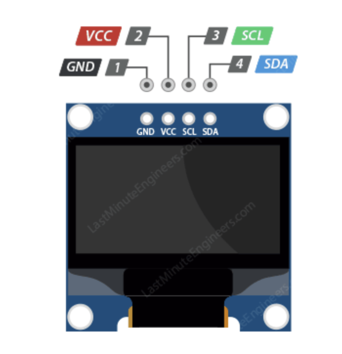
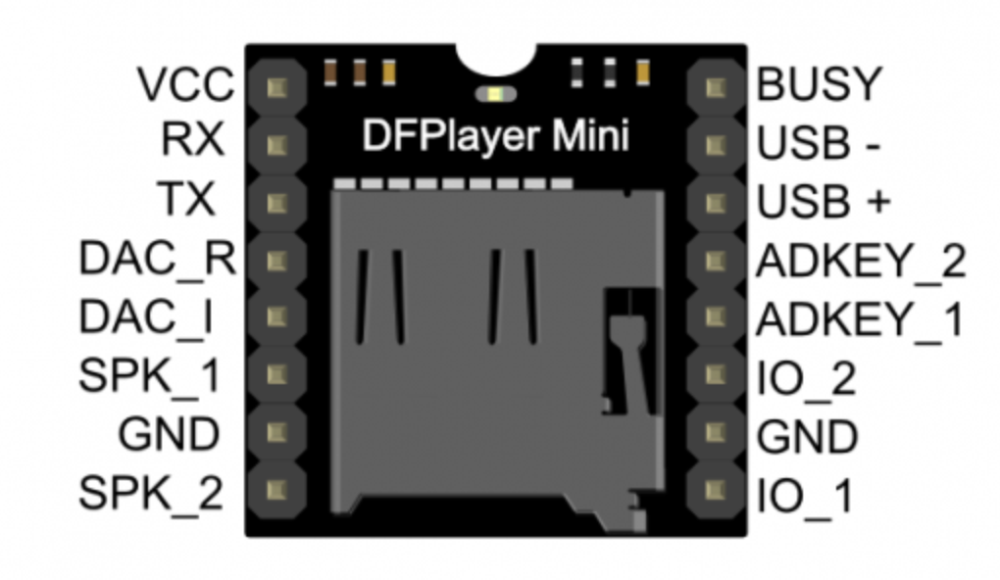
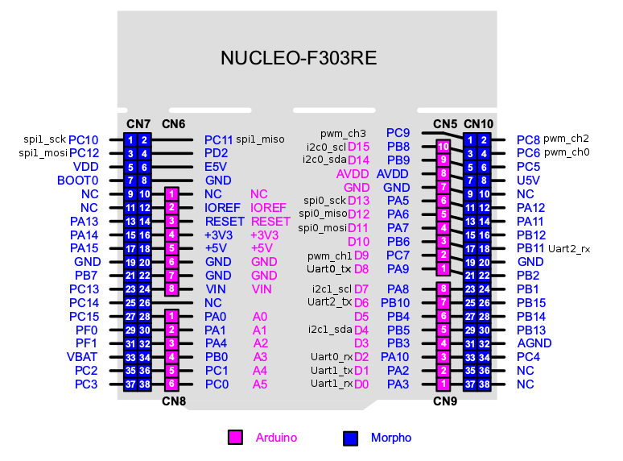
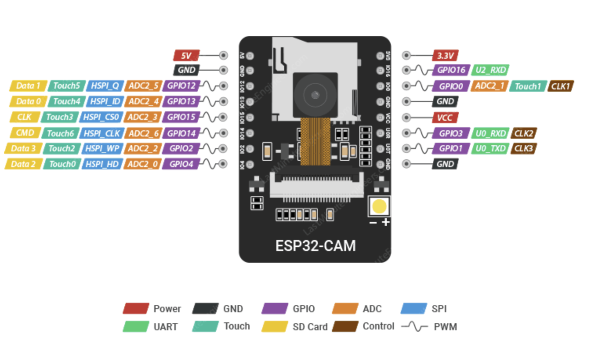

# STM-FaceGuard

**Hệ thống Khóa cửa thông minh nhận diện khuôn mặt — Dual-MCU**

Dự án đồ án môn học xây dựng hệ thống khóa cửa thông minh sử dụng kiến trúc Dual-MCU: **STM32F303RE** đảm nhận vai trò điều khiển trung tâm, **ESP32-S3 N16R8 CAM** (tích hợp camera OV3660 3MP) chạy thuật toán AI nhận diện khuôn mặt thời gian thực. Hệ thống hỗ trợ phản hồi âm thanh tiếng Việt qua DFPlayer Mini và hiển thị trạng thái trên màn hình OLED SSD1306.

---

## Mục lục

- [Tính năng](#tính-năng)
- [Kiến trúc hệ thống](#kiến-trúc-hệ-thống)
- [Danh sách linh kiện](#danh-sách-linh-kiện)
- [Hướng dẫn kết nối chi tiết](#hướng-dẫn-kết-nối-chi-tiết)
- [Cấu hình giao tiếp](#cấu-hình-giao-tiếp)
- [Hướng dẫn sử dụng](#hướng-dẫn-sử-dụng)
- [Màn hình OLED](#màn-hình-oled)
- [Cơ chế bảo mật](#cơ-chế-bảo-mật)
- [Giao thức UART](#giao-thức-uart)
- [Chuẩn bị file âm thanh](#chuẩn-bị-file-âm-thanh-dfplayer)
- [Công cụ phát triển](#công-cụ-phát-triển)
- [Cấu trúc dự án](#cấu-trúc-dự-án)
- [Thông số hệ thống](#thông-số-hệ-thống)

---

## Tính năng

- **Nhận diện khuôn mặt thời gian thực** — ESP32-S3 xử lý AI với camera OV3660 3MP, cosine similarity ≥ 0.60
- **Voting 2 frame liên tiếp** — yêu cầu 2 frame khớp liền nhau mới mở cửa, loại bỏ false positive từ nhiễu ảnh
- **Bảo vệ brute-force (Lockout)** — khoá 5 phút sau 5 lần nhận diện thất bại liên tiếp
- **Quản lý người dùng bằng nút nhấn** — Thêm và xóa khuôn mặt offline, không cần máy tính
- **Đăng ký 5 tư thế** — FRONT / LEFT / RIGHT / UP / DOWN cho độ chính xác cao trong mọi góc độ
- **Phản hồi âm thanh tiếng Việt** — DFPlayer Mini phát 10 file MP3 hướng dẫn
- **Hiển thị trạng thái OLED** — Màn hình 128×64 px hiển thị thông tin và hướng dẫn từng bước
- **Hiển thị số khuôn mặt** — Màn hình READY hiện số face đã đăng ký và slot còn trống
- **Thông báo DB đầy** — Hiển thị "DB is FULL!" khi đã đủ 7 khuôn mặt
- **Mở cửa từ bên trong** — Nút EXIT (PC13) ưu tiên cao nhất, hoạt động ngay lập tức
- **Lưu khuôn mặt vào Flash** — Tối đa 7 khuôn mặt lưu trong NVS Flash của ESP32-S3
- **Kết nối tự động** — Màn hình "Connecting..." khi boot; tự chuyển "OFFLINE" nếu ESP32 không phản hồi sau 30 giây
- **Watchdog kép** — IWDG (STM32, 3.2s) + Task WDT (ESP32, 30s) reset tự động nếu firmware bị treo
- **UART bền vững** — Hàng đợi 4 tin nhắn + tự phục hồi sau lỗi overrun/framing

---

## Kiến trúc hệ thống

```
┌─────────────────────────────────────────────────────────────────┐
│                        TẦNG ĐẦU VÀO                             │
│  [Camera OV3660 3MP]                 [BTN_EXIT   PC13 / Nucleo] │
│       tích hợp trong                [BTN_ENROLL  PA0          ] │
│  [ESP32-S3 N16R8 CAM]               [BTN_DELETE  PA1          ] │
│         │                                                        │
└─────────┼────────────────────────────────────────────────────────┘
          │ UART1 115200 baud
          │ PA9 (TX) ←→ GPIO2 (RX)
          │ PA10(RX) ←→ GPIO1 (TX)
          ▼
┌─────────────────────────────────────────────────────────────────┐
│                   TẦNG ĐIỀU KHIỂN TRUNG TÂM                     │
│                     STM32F303RE (72 MHz)                         │
│                     Nucleo-F303RE Board                          │
└────────┬─────────────────────┬──────────────────────┬───────────┘
         │ GPIO PB0            │ USART3 9600 baud      │ I2C1 100kHz
         ▼                     ▼                       ▼
┌──────────────────┐  ┌─────────────────────┐  ┌────────────────┐
│ BC547 → LY2N     │  │   DFPlayer Mini     │  │  OLED SSD1306  │
│ 12VDC Relay      │  │   + Loa 3070 3W     │  │  128×64 px     │
│      │           │  └─────────────────────┘  └────────────────┘
│ SM1373 12V Lock  │
└──────────────────┘
```

**Nguyên lý hoạt động:**
1. ESP32-S3 liên tục thu ảnh từ camera OV3660 tích hợp và chạy thuật toán Face Recognition
2. Nhận diện khớp **2 frame liên tiếp** (voting) → gửi `OPEN:<ID>` qua UART → STM32 kích relay mở khóa 3 giây
3. Nhận diện thất bại → gửi `DENIED` → STM32 phát cảnh báo; sau 5 lần thất bại → `LOCKOUT` → khoá 5 phút

**Luồng khởi động:**
```
[Boot] → SYS_CONNECTING (hiện "Connecting...") → nhận READY từ ESP32 → SYS_IDLE (hiện "READY")
                                ↓ timeout 30s nếu không nhận READY
                          SYS_OFFLINE (hiện "ESP32 OFFLINE")
```

---

## Danh sách linh kiện

### I. Khối Điều khiển & AI

| STT | Tên linh kiện | Thông số | Vai trò |
|-----|--------------|----------|---------|
| 1 | **Nucleo-F303RE** | STM32F303RE, Cortex-M4, 72 MHz, 512 KB Flash | Bộ não trung tâm: state machine, relay, OLED, DFPlayer |
| 2 | **ESP32-S3 N16R8 CAM** | Dual-core 240 MHz, 16 MB Flash, 8 MB PSRAM OPI | AI node: nhận diện khuôn mặt, giao tiếp UART STM32 |
| 3 | **Camera OV3660** | 3 MP, tích hợp sẵn trên board ESP32-S3 N16R8 CAM | Thu ảnh khuôn mặt chất lượng cao |

### II. Nút nhấn

| STT | Nút | Chân STM32 | Chức năng |
|-----|-----|-----------|-----------|
| 4 | **Nút EXIT** | PC13 (Blue Button Nucleo) | Mở cửa ngay từ bên trong — ưu tiên tuyệt đối |
| 5 | **Nút ENROLL** | PA0 (EXTI0) | Kích hoạt chế độ đăng ký khuôn mặt mới |
| 6 | **Nút DELETE** | PA1 (EXTI1) | Giữ 3 giây để xóa toàn bộ khuôn mặt |

> PC13 tận dụng nút xanh (Blue Button) có sẵn trên Nucleo-F303RE.

### III. Phản hồi & Hiển thị

| STT | Linh kiện | Thông số | Vai trò |
|-----|----------|----------|---------|
| 7 | **OLED SSD1306** | 0.96", 128×64 px, I2C 0x3C | Hiển thị trạng thái, hướng dẫn đăng ký |
| 8 | **DFPlayer Mini** | Giải mã MP3, UART 9600 baud | Phát âm thanh tiếng Việt |
| 9 | **Loa 3070** | 8 Ω, 3 W | Phát âm thanh |
| 10 | **Thẻ MicroSD** | 1–16 GB, FAT32 | Lưu 10 file MP3 cho DFPlayer |

### IV. Chấp hành & Nguồn

| STT | Linh kiện | Thông số | Vai trò |
|-----|----------|----------|---------|
| 11 | **Khóa SM1373 V3** | 12 V DC, Fail-Secure, ~0.5 A | Cơ cấu chốt khóa cửa |
| 12 | **Relay LY2N 12VDC** | Cuộn hút 12 V, tiếp điểm 10 A | Đóng/ngắt 12 V cho SM1373 |
| 13 | **Đế relay PTF08A** | 8 chân, socket kiểu Finder | Gắn relay LY2N dễ tháo lắp |
| 14 | **Transistor BC547** | NPN, 100 mA, 45 V | Kích relay LY2N từ GPIO 3.3 V của STM32 |
| 15 | **Nguồn 3.3 V** | Ổn định, ≥ 500 mA | Nuôi STM32 (Nucleo 3.3V pin) + OLED |
| 16 | **Nguồn 5 V** | Ổn định, ≥ 1 A | Nuôi ESP32-S3 + DFPlayer Mini |
| 17 | **Nguồn 12 V** | Ổn định, ≥ 1 A | Nuôi cuộn relay LY2N + khóa SM1373 |

### V. Phụ kiện

| STT | Linh kiện | Vai trò |
|-----|----------|---------|
| 18 | **Điện trở 4.7 kΩ** (×2) | Pull-up cho SDA và SCL của I2C (bắt buộc nếu module không có sẵn) |
| 19 | **Điện trở 1 kΩ** | Hạn dòng Base của BC547 và bảo vệ DFPlayer RX |
| 20 | **Diode 1N4007** (×2) | Chống dòng ngược (1 cái cho relay, 1 cái cho SM1373) |
| 21 | **Dây Jumper** | Kết nối tín hiệu giữa các module |
| 22 | **Breadboard** | Mạch thử nghiệm |

---

## Hướng dẫn kết nối chi tiết

> **Quy ước:** `→` là nguồn tín hiệu/điện, `←` là đích nhận.

---

### 1. Sơ đồ nguồn điện tổng thể

Hệ thống sử dụng **3 mức điện áp riêng biệt** từ nguồn cấp sẵn:

```
Nguồn 3.3V ──► OLED VCC
           ──► Nucleo 3.3V pin (CN6 pin 4)   ← để Nucleo không bị sụt áp nội bộ

Nguồn 5V   ──► ESP32-S3 5V pin
           ──► DFPlayer Mini VCC

Nguồn 12V  ──► LY2N Coil A1 (+)  [qua BC547, xem mục 5]
           ──► LY2N COM           [tiếp điểm cấp 12V cho SM1373]
```

#### Điểm nối đất chung (GND) — bắt buộc

Tất cả các dây GND sau đây phải nối về **cùng một điểm**:

| Thiết bị | Chân GND cần nối |
|----------|-----------------|
| Nguồn 3.3V | GND (–) |
| Nguồn 5V | GND (–) |
| Nguồn 12V | GND (–) |
| Nucleo-F303RE | CN6 pin 6 (GND) |
| ESP32-S3 | GND pin |
| OLED SSD1306 | GND pin |
| DFPlayer Mini | GND pin |
| BC547 | Emitter (chân E) |
| SM1373 | Dây ĐEN (–) |

> **Lý do:** UART giữa STM32 và ESP32-S3 cần GND chung làm điện áp tham chiếu. Nếu thiếu → tín hiệu UART nhiễu hoặc mất hoàn toàn → hệ thống không hoạt động.

---

### 2. ESP32-S3 N16R8 CAM ↔ STM32F303RE (UART1)

Đây là kết nối quan trọng nhất — chú ý **TX nối RX, RX nối TX**.

```
ESP32-S3          STM32F303RE (Nucleo CN10)     Nguồn
─────────         ──────────────────────────    ──────
5V           ◄──  (không nối STM32)         ◄── Nguồn 5V
GND          ───  GND                       ─── GND chung
GPIO1  (TX)  ──►  PA10 / D2  (USART1 RX)
GPIO2  (RX)  ◄──  PA9  / D8  (USART1 TX)
```

> Camera OV3660 tích hợp sẵn trên board ESP32-S3, **không cần nối thêm dây nào** cho camera.

**Lưu ý điện áp:** ESP32-S3 và STM32F303RE đều giao tiếp mức 3.3V — kết nối trực tiếp tín hiệu UART, không cần level shifter.

---

### 3. OLED SSD1306 ↔ STM32F303RE (I2C1)



```
OLED SSD1306      STM32F303RE (Nucleo CN10)     Nguồn ngoài
────────────      ──────────────────────────    ────────────
VCC          ◄──────────────────────────────── Nguồn 3.3V
GND          ──────────────────────────────── GND chung
SCL          ──►  PB8 / D15  (I2C1 SCL)
SDA          ──►  PB9 / D14  (I2C1 SDA)
```

> Địa chỉ I2C: **0x3C**. I2C chạy ở **100 kHz Standard Mode** (timing 0x10420F13) — ổn định trên breadboard, không cần Fast Mode.
>
> **Nếu OLED lúc nhận lúc không:** thêm 2 điện trở **4.7 kΩ** từ SDA→3.3V và SCL→3.3V (bắt buộc nếu module không có pull-up sẵn).

---

### 4. DFPlayer Mini ↔ STM32F303RE (USART3)



```
DFPlayer Mini     STM32F303RE (Nucleo CN7)     Nguồn
─────────────     ──────────────────────────   ──────
VCC          ◄──  (không nối STM32)        ◄── Nguồn 5V
GND          ───  GND                      ─── GND chung
RX           ◄──  [1 kΩ] ── PC10  (USART3 TX)  ← bắt buộc có điện trở 1kΩ
TX           ──►  PC11  (USART3 RX)
SPK+         ──►  Loa 3070 chân (+)
SPK–         ──►  Loa 3070 chân (–)
```

> **Bắt buộc** đặt điện trở **1 kΩ** nối tiếp trên dây PC10 → DFPlayer RX để bảo vệ chip DFPlayer khỏi mức điện áp cao.

---

### 5. Mạch kích Relay LY2N 12VDC (BC547 + STM32 PB0)

Relay LY2N có cuộn hút **12V / ~40mA** — không thể kích trực tiếp từ GPIO 3.3V. Cần transistor BC547 làm công tắc.

#### Sơ đồ mạch BC547:

```
STM32 PB0 (3.3V)
      │
    [1kΩ]
      │
      ├──► BC547 Base  (chân B)
             │
      BC547 Collector (chân C) ──► LY2N A2 (cuộn âm, chân 12 đế PTF08A)
      BC547 Emitter   (chân E) ──► GND chung

Nguồn 12V ────────────────────► LY2N A1 (cuộn dương, chân 11 đế PTF08A)

1N4007 (flyback): Anode → A2, Cathode → A1  [bảo vệ BC547 khỏi xung cảm ứng]
```

#### Sơ đồ chân BC547 nhìn từ mặt phẳng (chữ nổi hướng ra ngoài):

```
  [B]  [C]  [E]
  Base Collector Emitter
```

#### Nguyên lý:
- PB0 = **HIGH (3.3V)** → BC547 dẫn → Relay LY2N có điện (12V) → Tiếp điểm NO đóng → SM1373 mở khóa
- PB0 = **LOW (0V)**  → BC547 tắt → Relay nhả → Tiếp điểm NO mở → SM1373 khóa

---

### 6. Relay LY2N + Đế PTF08A ↔ Khóa SM1373

#### Sơ đồ chân PTF08A (nhìn từ phía cắm dây):

```
   ┌─────────────────────────────┐
   │  11  12  14  │  21  22  24  │   ← hàng tiếp điểm
   │                             │
   │       1    2                │   ← chân cuộn dây A1, A2
   └─────────────────────────────┘
   (Số chân theo chuẩn Omron/Finder — kiểm tra nhãn trên đế thực tế)
```

| Chân PTF08A | Nối tới | Ghi chú |
|------------|---------|---------|
| A1 (cuộn +) | 12V | Nguồn cuộn hút |
| A2 (cuộn –) | BC547 Collector | Qua BC547 xuống GND |
| COM (chân 12) | 12V | Cấp nguồn qua tiếp điểm |
| NO  (chân 11) | SM1373 dây ĐỎ (+) | Normally Open — đóng khi relay có điện |

```
Kết nối SM1373:
Nguồn 12V ──► LY2N COM (chân 12 PTF08A)
               LY2N NO  (chân 11 PTF08A) ──► SM1373 dây ĐỎ  (+)
GND chung ──────────────────────────────── SM1373 dây ĐEN (–)

1N4007 (bảo vệ SM1373): Anode → dây ĐEN, Cathode → dây ĐỎ
(mắc song song với SM1373, chống xung ngược khi ngắt điện)
```

> **SM1373 V3 — Fail-Secure:** Mất điện = khóa cứng. Có điện = mở chốt.

---

### 7. Nút nhấn ↔ STM32F303RE

Cả 3 nút dùng kiểu **active-LOW**: nhấn nút → chân GPIO nối GND → phát EXTI.

```
3.3V (pull-up nội bộ trong STM32)
  │
  ├── PA0  (BTN_ENROLL) ──[Nút ENROLL]── GND
  ├── PA1  (BTN_DELETE) ──[Nút DELETE]── GND
  └── PC13 (BTN_EXIT)   ──[Blue Button Nucleo]── GND  (đã có sẵn trên board)
```

> Code đã cấu hình **PULLUP + FALLING edge** cho PA0, PA1, PC13 trong `MX_GPIO_Init()`.
>
> **Quan trọng:** đấu nút theo đúng **tên chân MCU** `PA0` và `PA1`. Không dùng nhầm các chân Arduino `D2/D3`, vì chúng đang được dùng cho `PA10` (UART RX từ ESP32) và `PB0` (RELAY).

---

### 8. Tổng hợp pinout STM32F303RE



| Chân STM32 | Connector Nucleo | Tín hiệu | Kết nối tới |
|-----------|-----------------|----------|-------------|
| **PA9** | CN10 – D8 | USART1 TX | ESP32-S3 **GPIO2** (RX) |
| **PA10** | CN10 – D2 | USART1 RX | ESP32-S3 **GPIO1** (TX) |
| **PC10** | CN7 – D45 | USART3 TX | DFPlayer **RX** (qua 1kΩ) |
| **PC11** | CN7 – D44 | USART3 RX | DFPlayer **TX** |
| **PA2** | CN10 – D1 | USART2 TX | ST-Link Virtual COM (debug) |
| **PA3** | CN10 – D0 | USART2 RX | ST-Link Virtual COM (debug) |
| **PB8** | CN10 – D15 | I2C1 SCL | OLED **SCL** |
| **PB9** | CN10 – D14 | I2C1 SDA | OLED **SDA** |
| **PB0** | CN10 – D3 | GPIO OUT | [1kΩ] → **BC547 Base** |
| **PA5** | CN10 – D13 | GPIO OUT | LED xanh trên Nucleo (LD2) |
| **PC13** | — | EXTI13 | Blue Button Nucleo (BTN_EXIT) |
| **PA0** | Theo chân MCU `PA0` trên board | EXTI0 | Nút **ENROLL** → GND |
| **PA1** | Theo chân MCU `PA1` trên board | EXTI1 | Nút **DELETE** → GND |

---

### 9. Tổng hợp pinout ESP32-S3 N16R8 CAM



| GPIO | Chức năng | Kết nối |
|------|----------|---------|
| **GPIO1** | UART1 TX | → STM32 PA10 (USART1 RX) |
| **GPIO2** | UART1 RX | ← STM32 PA9 (USART1 TX) |
| GPIO4 | Camera SIOD | Tích hợp sẵn trên board |
| GPIO5 | Camera SIOC | Tích hợp sẵn trên board |
| GPIO6 | Camera VSYNC | Tích hợp sẵn trên board |
| GPIO7 | Camera HREF | Tích hợp sẵn trên board |
| GPIO8–13 | Camera D2–D7 | Tích hợp sẵn trên board |
| GPIO15 | Camera XCLK | Tích hợp sẵn trên board |
| GPIO16–18 | Camera D7–D5 | Tích hợp sẵn trên board |
| **5V** | Nguồn | Nguồn 5V ngoài |
| **GND** | Đất | GND chung |

---

## Cấu hình giao tiếp

### USART1 — ESP32-S3 ↔ STM32 (115200 baud)

| Thông số | Giá trị |
|---------|--------|
| Baud rate | 115200 |
| Data / Stop / Parity | 8N1 |
| STM32 TX | PA9 |
| STM32 RX | PA10 |
| ESP32-S3 TX | GPIO1 |
| ESP32-S3 RX | GPIO2 |
| Hàng đợi STM32 | 4 tin nhắn (tránh mất gói khi ESP32 gửi liên tiếp) |

### USART3 — DFPlayer Mini ↔ STM32 (9600 baud)

| Thông số | Giá trị |
|---------|--------|
| Baud rate | 9600 |
| Data / Stop / Parity | 8N1 |
| STM32 TX | PC10 (qua 1kΩ → DFPlayer RX) |
| STM32 RX | PC11 ← DFPlayer TX |

### I2C1 — OLED SSD1306 ↔ STM32

| Thông số | Giá trị |
|---------|--------|
| Chế độ | Standard Mode (100 kHz) — ổn định trên breadboard |
| Timing register | 0x10420F13 (ghi đè CubeMX trong USER CODE BEGIN I2C1_Init 2) |
| SCL | PB8 |
| SDA | PB9 |
| Địa chỉ OLED | 0x3C |
| Phục hồi lỗi | HAL_I2C_DeInit → HAL_I2C_Init nếu ACK không phản hồi |

---

## Hướng dẫn sử dụng

### Khởi động hệ thống

1. Cấp nguồn → STM32 khởi động, OLED hiển thị `"Booting..."` trong ~2 giây
2. OLED chuyển sang `"Connecting..."` — đang chờ ESP32-S3 boot xong
3. ESP32-S3 boot mất ~5–8 giây → gửi `READY` → OLED chuyển sang `"READY"`
4. Nếu sau **30 giây** không nhận được `READY` → OLED hiện `"ESP32 OFFLINE"` — kiểm tra dây UART và nguồn

> **Trong lúc "Connecting..."**: các nút ENROLL, DELETE, EXIT bị vô hiệu hóa. Hệ thống tự mở khóa sau khi nhận READY.

---

### Nhận diện tự động (IDLE)

ESP32-S3 liên tục quét khuôn mặt:

| Kết quả | Hành động OLED | Âm thanh |
|---------|----------------|----------|
| Khớp 2 frame (voting) | `"UNLOCKED — Face ID: X"` | Track 1: *"Xin chào, cửa đã mở"* |
| Không khớp | `"ACCESS DENIED"` | Track 2: *"Không nhận diện được, vui lòng thử lại"* |
| Không có mặt đăng ký | Giữ màn hình READY, im lặng | — |

> **Sau 5 lần DENIED liên tiếp** → kích hoạt lockout 5 phút (xem [Cơ chế bảo mật](#cơ-chế-bảo-mật))

---

### Đăng ký khuôn mặt mới (ENROLL)

1. Đứng trước camera, khoảng cách **30–60 cm**, ánh sáng đủ sáng
2. Nhấn nút **ENROLL** (PA0)
3. OLED hiện `"Enrolling..."`, loa phát *"Mời bạn nhìn vào camera"*
4. ESP32-S3 hướng dẫn 5 tư thế — **giữ mỗi tư thế ~2.5 giây**:

| Bước | OLED | Loa | Hành động |
|------|------|-----|-----------|
| 1/5 | `Step 1/5  Look STRAIGHT` | Track 6 | Nhìn thẳng — **ảnh được chụp tại bước này** |
| 2/5 | `Step 2/5  Turn LEFT` | Track 7 | Quay đầu sang trái ~30°, giữ 2.5s |
| 3/5 | `Step 3/5  Turn RIGHT` | Track 8 | Quay đầu sang phải ~30°, giữ 2.5s |
| 4/5 | `Step 4/5  Tilt UP` | Track 9 | Ngước đầu lên ~20°, giữ 2.5s |
| 5/5 | `Step 5/5  Tilt DOWN` | Track 10 | Cúi đầu xuống ~20°, giữ 2.5s |

5. Hoàn tất: OLED hiện `"ENROLLED — Face #X saved! (X/7 slots used)"`, loa phát *"Đã thêm khuôn mặt thành công"*
6. Màn hình tự quay về READY sau 3 giây

> **Lưu ý:**
> - Nếu không phát hiện khuôn mặt trong 10 giây, OLED nhắc lại bước hiện tại
> - Sau 15 giây không phản hồi từ ESP32, STM32 tự hủy đăng ký
> - Nếu DB đã đầy 7 slot → OLED hiện `"DB is FULL! — Delete to enroll"`, không thể đăng ký thêm

---

### Xóa toàn bộ khuôn mặt (DELETE)

1. Nhấn và **giữ** nút DELETE (PA1) trong **3 giây**
2. OLED hiển thị thanh tiến trình `"Hold 3s: Delete [====------]"`
3. Thả tay đúng 3s: OLED hiện `"Deleting..."`, ESP32-S3 xóa toàn bộ NVS flash
4. Xong: OLED hiện `"DELETED — All faces cleared"`, loa phát *"Đã xóa toàn bộ dữ liệu khuôn mặt"*
5. Màn hình tự quay về READY (hiện `"Press [ENROLL]!"`) sau 3 giây
6. Thả sớm trước 3s → hủy, không xóa; OLED về READY ngay

> **Lưu ý:** Xóa cũng đặt lại bộ đếm thất bại, hủy mọi lockout đang hoạt động.

---

### Mở cửa từ bên trong (EXIT)

1. Nhấn nút **EXIT** (PC13 — Blue Button Nucleo)
2. STM32 kích relay **ngay lập tức**, không qua ESP32
3. SM1373 mở chốt trong **3 giây**, OLED hiện `"UNLOCKED — (Exit button)"`
4. Nhấn lại EXIT trong lúc đang mở → reset đếm ngược 3 giây

---

## Màn hình OLED

Màn hình SSD1306 128×64 px được chia 8 trang (pages):

| Trang | Nội dung |
|-------|---------|
| Page 0 | Tiêu đề cố định: ` >> STM-FaceGuard` |
| Page 1 | Đường kẻ phân cách (solid) |
| Page 2–3 | Trạng thái chính (thay đổi theo state) |
| Page 4–5 | Chi tiết / hướng dẫn |
| Page 6–7 | Trống |

### Các màn hình theo trạng thái

| Trạng thái | OLED hiển thị | Khi nào |
|-----------|---------------|---------|
| `SYS_CONNECTING` | `Connecting... / Please wait` | Sau boot, chờ ESP32 |
| `SYS_OFFLINE` | `ESP32 OFFLINE / Check CAM/UART` | Timeout 30s không nhận READY |
| `SYS_IDLE` (0 face) | `** READY ** / Press [ENROLL]!` | Sẵn sàng, chưa có face nào |
| `SYS_IDLE` (có face) | `** READY ** / X face(s) stored` | Sẵn sàng, hiện số face |
| `SYS_UNLOCKING` | `** UNLOCKED ** / Face ID: X` | Đang mở cửa |
| `SYS_UNLOCKING` (exit) | `** UNLOCKED ** / (Exit button)` | Mở cửa bằng nút EXIT |
| `SYS_DENIED` | `** DENIED ** / Face not found!` | Nhận diện thất bại |
| `SYS_LOCKED` | `!! LOCKED OUT !! / Too many attempts` | Lockout bảo mật |
| `SYS_ENROLLING` | `Enrolling... / Look at camera!` | Đang đăng ký |
| `SYS_ENROLLING` (step) | `Step X/5 / Turn LEFT / <--(O)` | Hướng dẫn từng bước |
| `SYS_DELETING` | `Deleting... / Please wait` | Đang xóa |
| `SYS_RESULT` (enrolled) | `** ENROLLED ** / Face #X saved! / (X/7 slots used)` | Vừa đăng ký xong |
| `SYS_RESULT` (deleted) | `** DELETED ** / All faces cleared` | Vừa xóa xong |
| `SYS_RESULT` (db full) | `DB is FULL! / Delete to enroll` | Hết slot |

---

## Cơ chế bảo mật

### 1. Voting — Chống false positive

ESP32-S3 yêu cầu **2 frame liên tiếp** cùng nhận ra một Face ID với similarity ≥ 0.60 trước khi gửi `OPEN`. Nếu frame thứ 2 nhận ra ID khác → reset bộ đếm.

```
Frame 1: ID=2 sim=0.71 → vote=1/2
Frame 2: ID=2 sim=0.68 → vote=2/2 → CONFIRMED → gửi OPEN:2
```

### 2. Lockout — Chống brute-force

| Tham số | Giá trị |
|---------|--------|
| Ngưỡng thất bại | 5 lần liên tiếp |
| Thời gian khóa | 5 phút |
| Reset điều kiện | Nhận diện thành công **hoặc** xóa DB (DEL_ALL) |

**Luồng lockout:**
1. Thất bại lần 5 → ESP32 gửi `LOCKOUT` → STM32 vào `SYS_LOCKED`
2. OLED hiện `"!! LOCKED OUT !!"`, nút ENROLL/EXIT bị chặn
3. Sau 5 phút → ESP32 gửi `LOCKOUT_CLEAR` → STM32 về `SYS_IDLE`

### 3. Ngưỡng nhận diện

| Tham số | Giá trị | Điều chỉnh |
|---------|--------|------------|
| `RECOGNITION_THRESHOLD` | 0.60 | Tăng → an toàn hơn nhưng có thể từ chối người hợp lệ trong điều kiện ánh sáng xấu |
| `REQUIRED_MATCHES` | 2 | Tăng → chậm hơn nhưng ít false positive hơn |

### 4. Watchdog kép

| Watchdog | Vi điều khiển | Timeout | Tác dụng |
|---------|--------------|---------|----------|
| IWDG (Independent) | STM32F303RE | ~3.2 giây | Reset STM32 nếu main loop bị treo |
| Task WDT | ESP32-S3 | 30 giây | Panic + reset ESP32 nếu loop() bị treo |

> IWDG STM32 sử dụng LSI 32kHz độc lập — hoạt động ngay cả khi clock chính bị lỗi.

---

## Giao thức UART

### ESP32-S3 → STM32

| Lệnh | Khi nào | Ý nghĩa |
|------|---------|---------|
| `READY\n` | Khởi động xong | ESP32 sẵn sàng nhận lệnh |
| `FACES:<n>\n` | Ngay sau `READY` | Số khuôn mặt đã lưu trong DB |
| `OPEN:<ID>\n` | Voting xác nhận (2 frame) | Mở cửa, ID = số khuôn mặt |
| `DENIED\n` | Không nhận diện được | Từ chối |
| `ENROLLED:<ID>\n` | Đăng ký xong | Khuôn mặt mới, ID mới |
| `DELETED\n` | Xóa xong | Toàn bộ DB đã xóa |
| `DB_FULL\n` | ENROLL khi đã đủ 7 face | Hết slot, từ chối đăng ký |
| `LOCKOUT\n` | 5 lần thất bại liên tiếp | Kích hoạt khóa bảo mật |
| `LOCKOUT_CLEAR\n` | Hết 5 phút khóa | Bỏ khóa, về IDLE |
| `ENROLL_FRONT\n` | Bước 1/5 | Hướng dẫn nhìn thẳng |
| `ENROLL_LEFT\n` | Bước 2/5 | Hướng dẫn quay trái |
| `ENROLL_RIGHT\n` | Bước 3/5 | Hướng dẫn quay phải |
| `ENROLL_UP\n` | Bước 4/5 | Hướng dẫn ngẩng lên |
| `ENROLL_DOWN\n` | Bước 5/5 | Hướng dẫn cúi xuống |

### STM32 → ESP32-S3

| Lệnh | Khi nào | Ý nghĩa |
|------|---------|---------|
| `ENROLL\n` | Nhấn BTN_ENROLL | Bắt đầu đăng ký khuôn mặt |
| `DEL_ALL\n` | Giữ BTN_DELETE 3s | Xóa toàn bộ database |
| `CANCEL\n` | Timeout 15s lúc đăng ký | Hủy đăng ký |

### STM32 → DFPlayer Mini (USART3, 9600 baud)

Giao thức binary 10 byte:

```
0x7E  0xFF  0x06  CMD  0x00  ParamH  ParamL  CkH  CkL  0xEF
```

Checksum = `-(0xFF + 0x06 + CMD + 0x00 + ParamH + ParamL)`

---

## Chuẩn bị file âm thanh (DFPlayer)

### Nội dung 10 file MP3

| Track | File | Khi nào phát | Nội dung tiếng Việt |
|-------|------|-------------|---------------------|
| 1 | `0001.mp3` | Mở cửa thành công | *"Xin chào, cửa đã mở"* |
| 2 | `0002.mp3` | Nhận diện thất bại | *"Không nhận diện được, vui lòng thử lại"* |
| 3 | `0003.mp3` | Bắt đầu đăng ký | *"Mời bạn nhìn vào camera"* |
| 4 | `0004.mp3` | Đăng ký thành công | *"Đã thêm khuôn mặt thành công"* |
| 5 | `0005.mp3` | Xóa xong | *"Đã xóa toàn bộ dữ liệu khuôn mặt"* |
| 6 | `0006.mp3` | Bước 1/5 FRONT | *"Mời nhìn thẳng vào camera"* |
| 7 | `0007.mp3` | Bước 2/5 LEFT | *"Vui lòng quay đầu sang trái"* |
| 8 | `0008.mp3` | Bước 3/5 RIGHT | *"Vui lòng quay đầu sang phải"* |
| 9 | `0009.mp3` | Bước 4/5 UP | *"Vui lòng ngước đầu lên một chút"* |
| 10 | `0010.mp3` | Bước 5/5 DOWN | *"Vui lòng cúi đầu xuống một chút"* |

### Cách tạo file MP3

**VBee Studio** (giọng Việt tự nhiên nhất): [vbee.vn](https://vbee.vn) → Studio → nhập text → chọn giọng → tải MP3

**FreeText2Speech**: [freetts.com](https://freetts.com) → chọn Vietnamese → Export MP3

### Cấu trúc thẻ MicroSD (FAT32)

```
[Thư mục gốc thẻ nhớ — không tạo thư mục con]
├── 0001.mp3
├── 0002.mp3
├── 0003.mp3
├── 0004.mp3
├── 0005.mp3
├── 0006.mp3
├── 0007.mp3
├── 0008.mp3
├── 0009.mp3
└── 0010.mp3
```

> Copy file theo **đúng thứ tự 0001 → 0010**, eject thẻ đúng cách trước khi rút.

---

## Công cụ phát triển

| Công cụ | Mục đích |
|---------|---------|
| **STM32CubeIDE** | IDE lập trình + nạp code STM32F303RE |
| **STM32CubeMX 6.17** | Cấu hình Pinout, Clock, Peripheral |
| **STM32 HAL FW_F3 V1.11.6** | Thư viện HAL cho STM32F3 |
| **Arduino IDE** | Lập trình ESP32-S3 |
| **ESP32 Arduino core ≥ 2.0.6** | Board package + thư viện AI nhận diện mặt |
| **ST-Link V2-1 (tích hợp Nucleo)** | Nạp + debug STM32 |

### Cài đặt board ESP32-S3 trong Arduino IDE

```
Board:            ESP32S3 Dev Module
PSRAM:            OPI PSRAM
Flash Size:       16MB (128Mb)
Flash Mode:       QIO 80MHz
Partition Scheme: Huge APP (3MB No OTA / 1MB SPIFFS)
USB CDC On Boot:  Enabled
```

---

## Cấu trúc dự án

```
STM-FaceGuard/
├── STM32/                          # Firmware STM32F303RE (STM32CubeIDE)
│   ├── Core/
│   │   ├── Src/
│   │   │   ├── main.c              # State machine + UART/EXTI callbacks + IWDG
│   │   │   ├── ssd1306.c           # OLED driver (SSD1306) + font 5×7
│   │   │   ├── dfplayer.c          # DFPlayer Mini UART binary protocol
│   │   │   └── stm32f3xx_it.c      # IRQ handlers (EXTI, USART)
│   │   └── Inc/
│   │       ├── main.h              # Pin definitions
│   │       ├── ssd1306.h           # OLED screen function declarations
│   │       └── dfplayer.h          # Track number defines
│   ├── Drivers/                    # HAL + CMSIS (auto-generated)
│   ├── STM-FaceGuard.ioc           # CubeMX config
│   └── STM32F303RETX_FLASH.ld      # Linker script
│
├── ESP32-S3/                       # Firmware ESP32-S3 (Arduino IDE)
│   └── STM-FaceGuard/
│       └── STM-FaceGuard.ino       # Face recognition + voting + lockout + UART
│
└── README.md
```

---

## Thông số hệ thống

| Thông số | Giá trị |
|---------|--------|
| Vi điều khiển chính | STM32F303RET6, Cortex-M4, 72 MHz |
| Flash / RAM STM32 | 512 KB / 64 KB |
| Vi điều khiển AI | ESP32-S3 Dual-core, 240 MHz |
| Flash / PSRAM ESP32 | 16 MB / 8 MB OPI |
| Camera | OV3660, 3 MP, tích hợp board |
| Khuôn mặt tối đa | **7 khuôn mặt** (lưu trong NVS Flash) |
| Ngưỡng nhận diện (similarity) | **≥ 0.60** (cosine similarity) |
| Voting trước khi mở cửa | **2 frame liên tiếp** khớp |
| Thời gian nhận diện | ~0.2–0.4 giây (2 frame × ~100ms) |
| Thời gian mở cửa | 3 giây |
| Thời gian giữ mỗi tư thế đăng ký | 2.5 giây |
| Timeout đăng ký | 15 giây (STM32) / 10 giây/bước (ESP32) |
| Timeout kết nối ESP32 | 30 giây → SYS_OFFLINE |
| Lockout sau thất bại | 5 lần → khóa 5 phút |
| Watchdog STM32 (IWDG) | ~3.2 giây (LSI 32kHz, prescaler 64, reload 1999) |
| Watchdog ESP32 (Task WDT) | 30 giây |
| I2C OLED | Standard Mode 100 kHz (timing 0x10420F13) |
| Relay | LY2N 12VDC, tiếp điểm 10 A |
| Điện áp khóa SM1373 | 12 V DC |
| Nguồn cấp khuyến nghị | Adapter 12 V – 2 A |
